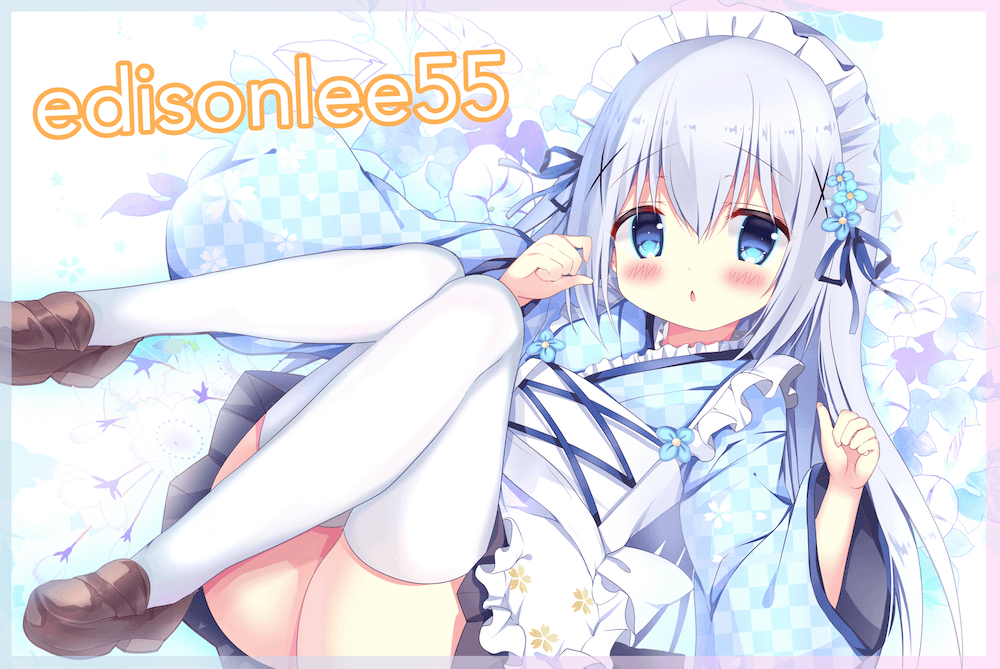

    

<h1 align="center">Hi 👋, I'm <a>Roberto Zhong</a>!</h1>

<!--

  
  

  <strong><a>Official Website</a></strong> |
  <strong><a href="https://twitter.com/edisonlee55">Twitter</a></strong> |
  <strong><a href="https://discord.gg/nYXzaUS">Discord</a></strong> |
  <strong><a href="https://www.linkedin.com/in/edisonlee55">LinkedIn</a></strong> |
  <strong><a href="https://www.twitch.tv/edisonlee55">Twitch</a></strong>

-->

##### BIO

- 🌱 I’m currently learning  **Docker, AWS, Spring**
- ⚙️ I use daily: `.py`, `.java`, `.html`, `.css`, `.js`

<!--
**LoveHachi/LoveHachi** is a ✨ _special_ ✨ repository because its `README.md` (this file) appears on your GitHub profile.

Here are some ideas to get you started:

- 🔭 I’m currently working on ...
- 🌱 I’m currently learning ...
- 👯 I’m looking to collaborate on ...
- 🤔 I’m looking for help with ...
- 💬 Ask me about ...
- 📫 How to reach me: ...
- 😄 Pronouns: ...
- ⚡ Fun fact: ...
-->
